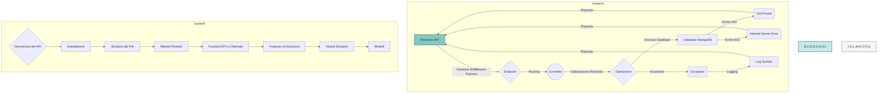
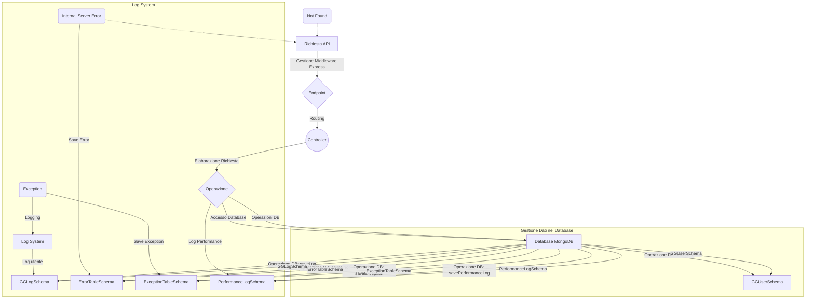

# Descrizione del API

Questo progetto implementa un server React locale con connessione a MongoDB attraverso un'API. Di seguito è riportato il dettaglio dei file e delle funzionalità principali.
# Installazione

Il server Node.js si integra con il server React e richiede l'esecuzione di alcuni comandi per garantire il corretto funzionamento del progetto. Ecco una guida passo-passo per l'installazione:

1. Assicurati di avere [Node.js](https://nodejs.org/) installato sul tuo sistema.
2. Clona il repository del progetto nella tua macchina locale.
3. Naviga nella directory del progetto tramite il terminale.
4. Esegui il comando:
   ```
   npm install
   ```
   Questo installerà tutte le dipendenze necessarie elencate nel file `package.json`.

5. Crea un file `.env` nella directory principale del progetto e imposta le variabili d'ambiente necessarie. Ecco un esempio di configurazione `.env`:

   ```
   # Configurazione del database MongoDB
   MONGODB_URI=mongodb://localhost:27017/GGJSDB

   # Porta su cui verrà avviato il server
   API_PORT=3001

   # Configurazione per l'invio di email tramite Gmail
   EMAIL_USER=your_email@gmail.com
   EMAIL_CODE=your_email_password

   # Indirizzo email del proprietario per le notifiche
   OWNER_EMAIL=owner_email@gmail.com
   ```

6. Ora puoi avviare il server Node.js con il comando:
   ```
   npm run avvia
   ```
   Questo comando avvierà sia il server Node.js che il server React, garantendo un'esperienza di sviluppo integrata.
## Struttura dei File
```
│ appConfig.js
│ routes.js
│ runExceptionManager.js
│ server.js
│ userController.js
│
├───methods
│ cutdelpatchmethod.js
│ getmethod.js
│ internalmethod.js
│ mailsender.js
│ postmethod.js
│ testmethod.js
│
└───models
  ErrExpSchema.js
  GGLogSchema.js
  GGUserSchema.js
```

## Metodi Presenti

### userControl.js

```plaintext
registerUser(req, res)
loginUser(req, res)
getLogsForUser(req, res)
```

### server.js

Nessun metodo specifico. Configura il server e gestisce la connessione al database.

### runExceptionManager.js

```plaintext
handleUncaughtException(err)
handleUnhandledRejection(reason)
sendNotificationEmail(subject, message)
```

### routes.js

Nessun metodo specifico. Definisce le route e collega i controller appropriati.

### appConfig.js

Nessun metodo specifico. Configura l'applicazione Express, i middleware, e gestisce gli errori.

### GGUserSchema.js

Nessun metodo specifico. Definisce lo schema del modello utente.

### GGLogSchema.js

Nessun metodo specifico. Definisce lo schema del modello di log utente e log dei test.

### ErrExpSchema.js

Nessun metodo specifico. Definisce gli schemi delle tabelle di errori e eccezioni.

### testmethod.js
```
    testWithTiming(req, res)
    test(req, res)
```
### postmethod.js

```plaintext
createUser(req, res)
```

### mailsender.js

```plaintext
sendVerificationEmail(req, res)
```

### internalmethod.js

```plaintext
createLog(user, req, operation, httpStatus, logLevel, modifiedData, modifiedFields)
logError(error, details, additionalInfo, stackTrace)
logException(exception, details, stackTrace)
```

### getmethod.js

```plaintext
getUsers(req, res)
getUserByEmail(req, res)
```

### cutdelpatchmethod.js

```plaintext
updateUser(req, res)
deleteUser(req, res)
```

## Funzioni API e Chiamate

### 1. `registerUser`

   - Descrizione: Registra un nuovo utente.
   - Metodo: POST
   - Endpoint: /api/register
   - Esempio: `http://localhost:3001/api/register`
   - Corpo della richiesta: `{ "Email_utente": "newuser@giorgimi.edu.it", "Pw_utente": "password123", "Nome_utente": "Nuovo", "Cognome_utente": "Utente" }`

### 2. `loginUser`

   - Descrizione: Verifica l'utente al login.
   - Metodo: POST
   - Endpoint: /api/login
   - Esempio: `http://localhost:3001/api/login`
   - Corpo della richiesta: `{ "Email_utente": "johndoe@giorgimi.edu.it", "Pw_utente": "password123" }`

### 3. `test` [!WARNING][deprecata]

   - Descrizione: Funzione di test.
   - Metodo: Qualsiasi
   - Endpoint: /api/test
   - Esempio: `http://localhost:3001/api/test`

### 4. `getLogsForUser`

   - Descrizione: Ottiene i log per un utente.
   - Metodo: GET
   - Endpoint: /api/logs/user/:email
   - Esempio: `http://localhost:3001/api/logs/user/johndoe@giorgimi.edu.it`

### 5. `createUser`

   - Descrizione: Aggiunge un nuovo utente.
   - Metodo: POST
   - Endpoint: /api/users
   - Esempio: `http://localhost:3001/api/users`
   - Corpo della richiesta: `{ "Email_utente": "newuser@giorgimi.edu.it", "Pw_utente": "password123", "Nome_utente": "Nuovo", "Cognome_utente": "Utente" }`

### 6. `sendVerificationEmail`

   - Descrizione: Invia un'email di verifica.
   - Metodo: POST
   - Endpoint: /api/sendVerificationEmail
   - Esempio: `http://localhost:3001/api/sendVerificationEmail`
   - Corpo della richiesta: `{ "to": "newuser@giorgimi.edu.it", "verificationCode": "123456" }`

### 7. `getUsers`

   - Descrizione: Ottiene tutti gli utenti.
   - Metodo: GET
   - Endpoint: /api/users
   - Esempio: `http://localhost:3001/api/users`

### 8. `getUserByEmail`

   - Descrizione: Ottiene un utente per email.
   - Metodo: GET
   - Endpoint: /api/users/:email
   - Esempio: `http://localhost:3001/api/users/johndoe@giorgimi.edu.it`

### 9. `updateUser`

   - Descrizione: Aggiorna un utente per email.
   - Metodo: PUT
   - Endpoint: /api/users/:email
   - Esempio: `http://localhost:3001/api/users/johndoe@giorgimi.edu.it`
   - Corpo della richiesta: `{ "Nome_utente": "NuovoNome" }`

### 10. `deleteUser`

   - Descrizione: Elimina un utente per email.
   - Metodo: DELETE
   - Endpoint: /api/users/:email
   - Esempio: `http://localhost:3001/api/users/johndoe@giorgimi.edu.it`
### 3. `testWithTiming`

   - Descrizione: Funzione di test.
   - Metodo: Qualsiasi
   - Endpoint: /api/testTime
   - Esempio: `http://localhost:3001/api/testTime`

## Features di Sicurezza

1. Gestione eccezioni e invio mail nel caso di eccezioni gravi.
2. Hashing e salting delle password.
3. Utilizzo di Helmet per migliorare la sicurezza HTTP.
4. Express Rate Limit per limitare le richieste.
5. Gestione approfondita degli errori con risposte HTTP appropriate.
6. Logging degli utenti.
7. Gestione della chiusura della connessione al database.
8. Politiche CORS sulla connessione in locale.
9. Gestione centralizzata degli errori http.

## Moduli Esistenti

- bcrypt
- express
- mongoose
- nodemailer
- dotenv
- helmet
- cors
- express-rate-limit

## app.use() e Spiegazione

1. `express.json()`: Middleware per gestire il parsing del corpo della richiesta in formato JSON.
2. `bodyParser.json()`: Middleware per il parsing del corpo della richiesta in formato JSON.
3. `helmet()`: Middleware che implementa diverse protezioni di sicurezza HTTP.
4. `cors(corsOptions)`: Middleware per la gestione delle politiche CORS con opzioni specifiche.
5. `express-rate-limit(limiter)`: Middleware per limitare la frequenza delle richieste.
6. Middleware personalizzato per la registrazione degli errori e invio di email di notifica.

# Modelli

Il progetto utilizza modelli MongoDB per definire la struttura dei dati salvati nel database. Qui di seguito sono presentati i principali modelli utilizzati nel progetto:

## GGUserSchema

Questo modello rappresenta un utente nel sistema.

### Campi del Modello:

- `_id`: Identificatore univoco generato automaticamente.
- `Email_utente`: Stringa, email dell'utente (unica e richiesta).
- `Nome_utente`: Stringa, nome dell'utente.
- `Cognome_utente`: Stringa, cognome dell'utente.
- `CF_utente`: Stringa, codice fiscale dell'utente.
- `Tp_sesso_utente`: Stringa, sesso dell'utente (valori ammessi: 'F', 'M').
- `Id_area_utente`: Numero intero, identificatore dell'area di appartenenza dell'utente.
- `Id_classe_concorso_utente`: Numero intero, identificatore della classe di concorso dell'utente.
- `Id_sede_servizio_utente`: Numero intero, identificatore della sede di servizio dell'utente.
- `Id_servizio_utente`: Numero intero, identificatore del servizio dell'utente.
- `Dt_nascita_utente`: Data di nascita dell'utente.
- `Pin_utente`: Numero intero, PIN dell'utente.
- `Pw_utente`: Stringa, password dell'utente (richiesta).
- `Flg_attivo_utente`: Booleano, indica se l'utente è attivo.
- `Flg_part_time_congedi`: Booleano, indica se l'utente è a part-time con congedi.
- `N_gg_part_time_congedi`: Numero intero, numero di giorni di congedo per utenti part-time.
- `Flg_3anni_servizio`: Booleano, indica se l'utente ha almeno 3 anni di servizio.
- `Id_utente_modifica_utente`: Numero intero, identificatore dell'utente che ha modificato l'utente corrente.
- `Dt_utente_modifica_utente`: Data e ora dell'ultima modifica dell'utente.
- `Flg_segretario_utente`: Booleano, indica se l'utente è un segretario.
- `Flg_richiesta_pin`: Booleano, indica se l'utente ha richiesto un nuovo PIN.
- `logs`: Array di riferimenti a log associati a questo utente.

### Relazioni:

- `logs`: Array di riferimenti a log associati a questo utente.

## GGUserLogSchema

Questo modello rappresenta un log delle attività dell'utente.

### Campi del Modello:

- `date`: Data e ora del log.
- `ip`: Stringa, indirizzo IP da cui è stata effettuata l'azione.
- `operation`: Stringa, tipo di operazione eseguita.
- `httpStatus`: Numero intero, stato HTTP della richiesta.
- `logLevel`: Stringa, livello di log (es. 'info', 'error').
- `modifiedData`: Oggetto, dati modificati durante l'operazione.
- `requestType`: Stringa, tipo di richiesta HTTP (GET, POST, PUT, DELETE).
- `modifiedFields`: Array di stringhe, campi modificati durante l'operazione.

## ErrorTableSchema

Questo modello rappresenta una tabella di errori generici.

### Campi del Modello:

- `timestamp`: Data e ora dell'errore.
- `error`: Stringa, descrizione dell'errore.
- `details`: Stringa, dettagli aggiuntivi sull'errore.
- `additionalInfo`: Stringa, informazioni aggiuntive sull'errore.
- `stackTrace`: Stringa, traccia dello stack dell'errore.

## ExceptionTableSchema

Questo modello rappresenta una tabella di eccezioni.

### Campi del Modello:

- `timestamp`: Data e ora dell'eccezione.
- `exception`: Stringa, descrizione dell'eccezione.
- `details`: Stringa, dettagli aggiuntivi sull'eccezione.
- `stackTrace`: Stringa, traccia dello stack dell'eccezione.
## PerformanceLogSchema

Questo modello rappresenta una tabella di salvataggio dei tempi di risposta.

### Campi del Modello:

- `date`:Data e ora del test
- `operation`: Stringa, Descrizione
- `writeTime`: Number, Tempo di scrittura in ms
- `readTime`: Number, Tempo di lettura in ms
- `updateTime`: Number, Tempo di modifica in ms
- `deleteTime`: Number, Tempo di cancellatura in ms
- `totalTime`: Number, Tempo totale in ms
- `autochk`: Booleano, Se è eseguito in automatico o meno

# Diagramma di Flusso - Richiesta API


